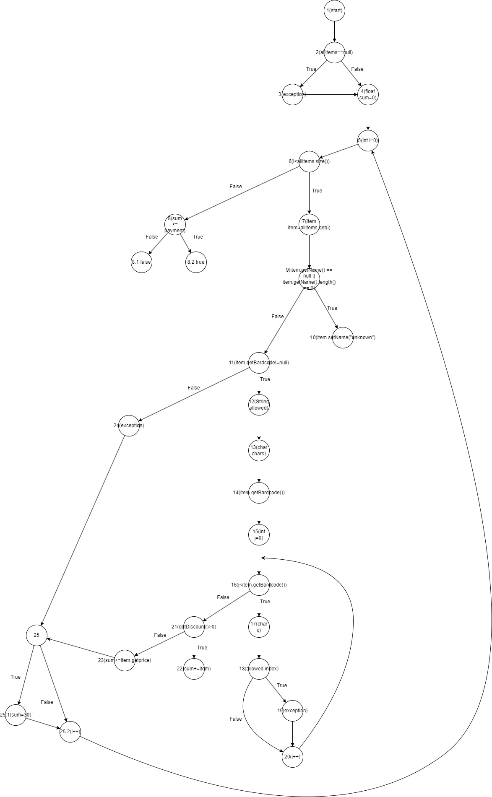

# SI_2024_lab2_191175
Марко Томовски 191175
2. 

3. Цикломатската комплексност ја пресметав на следниот начин:
Во самиот код постојат јазли(10 оператори, 5 услови), ребра(item класата 8, SILab2 4) и поврзани компоненти(1).

Цикломатска комплексност изнесува 9.

4. Тест случаи според Every Branch критериумот би биле:
    - Случај кога allItems e null
    - Случај кога name на предметот e null
    - Случај кога barcode на предметот не е null и содржи само цифри
    - Случај кога barcode на предметот не е null и содржи други знаци освен цифри
    - Случај кога discount на предметот е пгоолем од 0
    - Случај кога discount на предметот е 0
    - Случај кога price на предметот е поголем од 300, discount е поголем од 0, а првата цифра е '0'
    - Случај кога sum е помал од payment
    - Случај кога sum е еднаков на payment
    - Случај кога sum е поголем од payment

5. 
    - item.getPrice() > 300 е true, item.getDiscount() > 0 е true, item.getBarcode().charAt(0)== '0' е true.
    - Тест случај кога item.getPrice() > 300 е true, item.getDiscount() > 0 е true, а item.getBarcode().charAt(0) == '0' е false
    - Тест случај кога item.getPrice() > 300 е true, item.getDiscount() > 0 е false, а item.getBarcode().charAt(0) == '0' е true
    - Тест случај кога item.getPrice() > 300 е true, item.getDiscount() > 0 е false, а item.getBarcode().charAt(0) == '0' е false
    - Тест случај кога item.getPrice() > 300 е false, item.getDiscount() > 0 е true, а item.getBarcode().charAt(0) == '0' е true
    - Тест случај кога item.getPrice() > 300 е false, item.getDiscount() > 0 е true, а item.getBarcode().charAt(0) == '0' е false